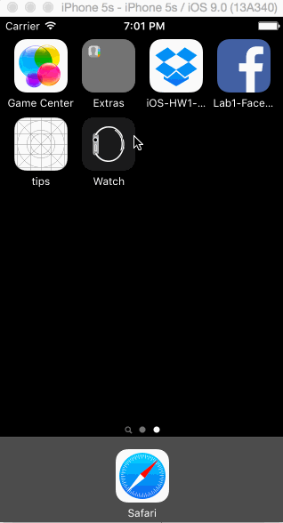

# iOS-HW1-Dropbox
first homework for into to iOS class

This took probably a little under 10 hours.

What does the app do?

Project Requirements

User can tap through the 3 welcome screens.

User can follow the create user flow.
  On the create user form, the user can tap the back button to go to the page where they can sign in or create an account.
  
  Before creating the account, user can choose to read the terms of service.
  
  After creating the account, user can view the placeholders for Files, Photos, and Favorites as well as the Settings screen.
  
  User can log out from the Settings screen.
  
  User can follow the sign in flow.
  
  User can tap the area for "Having trouble signing in?"
  
  User can log out from the Settings screen.
  
Optional: You should be able to swipe through the welcome screens instead of just tapping them.

What did I miss?

The GIF was created with LiceCap.
